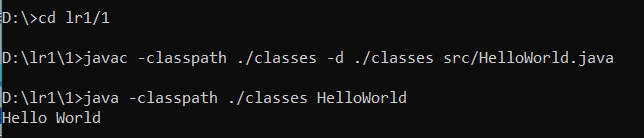
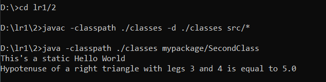
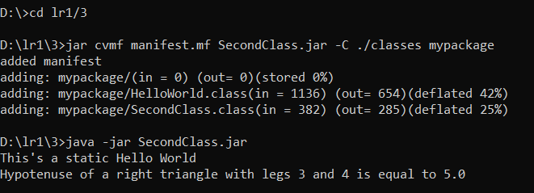

= Отчет по лабораторной работе 1

По дисциплине "Современные технологии промышленной разработки программного обеспечения"

Студент группы ИВМ-22: Андрианова Г. Н.

:toc-title: Содержание
:toc:
:example-caption: Структура
:listing-caption: Листинг
:source-highlighter: rouge

== 1 Постановка задачи
В процессе выполнения лабораторной работы необходимо выполнить следующие задачи:

. Создать исполняемый java класс, который выводит текстовую строку на экран
. Разработать два класса. Первый класс вызывает 2 метода из второго класса (статический и нестатический)
. Создать jar-файл, хранящий элементы из предыдущего задания

== 2 Разработка задачи
=== 2.1 Структура проекта
.Структура проекта первого задания
========
----
lr1
  `-- 1
      |-- classes
      |      `-- HelloWorld.class
      `-- src
             `-- HelloWorld.java
----
========

.Структура проекта второго задания
========
----
lr1
  `-- 2
      |-- classes
      |     `-- mypackage
      |            |-- HelloWorld.class
      |            `-- SecondClass.class
      `-- src
           |-- HelloWorld.java
           `-- SecondClass.java
----
========

.Структура проекта третьего задания
========
----
lr1
  `-- 3
      |-- manifest.mf
      |-- SecondClass.jar
      |-- classes
      |     `-- mypackage
      |            |-- HelloWorld.class
      |            `-- SecondClass.class
      `-- src
           |-- HelloWorld.java
           `-- SecondClass.java
----
========
== 3 Информация о реализации
=== 3.1 Задание 1
.Листинг класса HelloWorld
[source,java]
----
public class HelloWorld{

	public static void main(String args[]){
		System.out.println("Hello World");
	}
}
----
Для компиляции файла использовалась команда javac в командной строке

.Команда javac
----
javac -classpath ./classes -d ./classes src/HelloWorld.java
----

Для запуска файла в командной строке использовалась команда java.

.Команда java
----
java -classpath ./classes HelloWorld
----
При запуске скомпилированного файла в командной строке выводится строка "Hello World".

=== 3.2 Задание 2
.Листинг класса HelloWorld
[source,java]
----
package mypackage;

public class HelloWorld{
	int a=3,b=4;

	public static void StaticHello(){
		System.out.println("This's a static Hello World");
	}

	public void Hypotenuse() {
		double c = Math.sqrt(a*a+b*b);
		System.out.println("Hypotenuse of a right triangle with legs "+a+" and "+b+" is equal to "+c);
	}
}
----
.Листинг класса SecondClass
[source,java]
----
package mypackage;

import mypackage.HelloWorld;

public class SecondClass{

	public static void main(String args[]){

		HelloWorld hi = new HelloWorld();
		HelloWorld.StaticHello();
		hi.Hypotenuse();
	}
}
----
Для компиляции файлов использовалась команда javac в командной строке

.Команда javac
----
javac -classpath ./classes -d ./classes src/*
----

Для запуска файла SecondClass в командной строке использовалась команда java.

.Команда java
----
java -classpath ./classes mypackage/SecondClass
----
При запуске в командной строке выводятся строки
----
"This's a static HelloWorld"
"Hypotenuse of a right triangle with legs 3 and 4 is equal to 5.0"
----

=== 3.3 Задание 3
Для создания архива был создан файл manifest.mf, в котором был указан главный исполняемый класс:

.Листинг manifest.mf
----
Manifest-Version: 1.0
Created-By: 1.6.0_19 (Sun Microsystems Inc.)
Main-Class: mypackage.SecondClass

----

.Команда по сборке архива
----
jar cvmf manifest.mf SecondClass.jar -C ./classes mypackage
----

.Команда запуска jar-файла
----
java -jar SecondClass.jar
----

== 4 Результаты выполнения
В результате выполнения первого задания был получен класс Helloworld. При запуске выводится строка:

В результате выполнения второго задания были получены классы Helloworld и SecondClass. При запуске выводятся строки:

В результате выполнения третьего задания был получен jar-файл SecondClass. При запуске jar-файла выводятся строки:

== 5 Вывод
В процессе выполнения лабораторной работы были изучены команды javac - для компиляции классов в байт-код, java - для запуска проектов, jar - для создания jar-файлов.
